# JWT and refresh tokens

There are two credentials. The **JWT is only the access token**. The **refresh token is not a JWT**: it is a random opaque string stored as a SHA-256 hash.

Issue and rotate live in `backend/auth-service/src/tokens.ts`. Verify lives in `packages/service-kit` (`requireJwt`, `optionalJwt`, `verifyAccessToken`) and, when Kong is up, in `docker/kong/access.lua`. Role is **not** in the JWT; after a valid access token, services load the user from Postgres.

| | Access JWT | Refresh token |
| --- | --- | --- |
| Format | HS256 JWT | 32-byte random, base64url |
| Stored | Nowhere (stateless until `exp`) | `RefreshToken.tokenHash` (SHA-256) |
| TTL | `JWT_ACCESS_EXPIRES` (default **15m**) | Sliding `JWT_REFRESH_EXPIRES_DAYS` (7) capped by `JWT_REFRESH_ABSOLUTE_DAYS` (30) |
| Sent as | `Authorization: Bearer …` | JSON body (`refreshToken`) on `/auth/jwt/refresh` and logout |
| Revoked | Not until expiry (`jti` is unused) | Family revoke on logout, reuse, or password reset |

Who gets a pair:

| Flow | Roles | Endpoint |
| --- | --- | --- |
| Password login | `user`, `shop` only | `POST /auth/jwt/login` |
| Signup | always `user` | `POST /auth/jwt/signup` |
| Google OAuth | public roles only | `/auth/oauth/google/callback` |
| Admin after session cookie | `superadmin`, `sales`, `marketing` | `POST /auth/jwt/from-session` |

Admins cannot use public JWT login (403). Public roles cannot use session login (403).

## Access JWT claims

Signed with `JWT_SECRET`, `algorithm: HS256`, `iss` = `JWT_ISSUER` (default `rwa-auth`), `aud` = `JWT_AUDIENCE` (default `rwa`).

| Claim | Meaning |
| --- | --- |
| `sub` | user id |
| `username` | username |
| `typ` | always `"access"` |
| `jti` | unique id per token (not denylisted) |
| `iss` / `aud` / `exp` | set by `jsonwebtoken` |

Verify always requires HS256, matching `iss`/`aud`, 5s clock skew, and `typ === "access"`. A refresh string used as Bearer fails (`token_invalid`). Expired access → `token_expired`. Missing Bearer on a required route → `token_invalid`.

## RefreshToken rows

| Field | Role |
| --- | --- |
| `tokenHash` | unique SHA-256 of the raw token |
| `familyId` | rotation family; reuse of a revoked member revokes the whole family |
| `expiresAt` | sliding window |
| `absoluteExpiresAt` | hard cap, copied onto each rotation |
| `revokedAt` | set on rotate, logout, expiry, or family kill |
| `replacedById` | points at the next row after a successful rotate |

Public site keeps the raw refresh token in `sessionStorage` (`rwa.public.refresh`) and refreshes ~30s before access expiry. Admin keeps tokens in memory after `from-session`.

---

## 1. Public JWT login (issue pair)

Password login for `user` / `shop`. Captcha runs first when Altcha is on. Admins get 403.

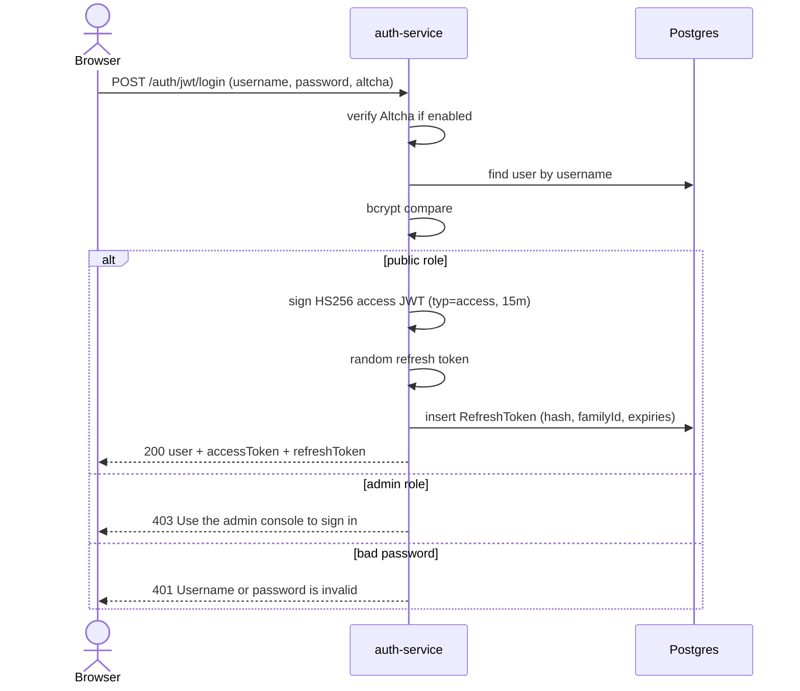

## 2. Public JWT signup (issue pair)

Creates a `user` account and the same token pair as login.

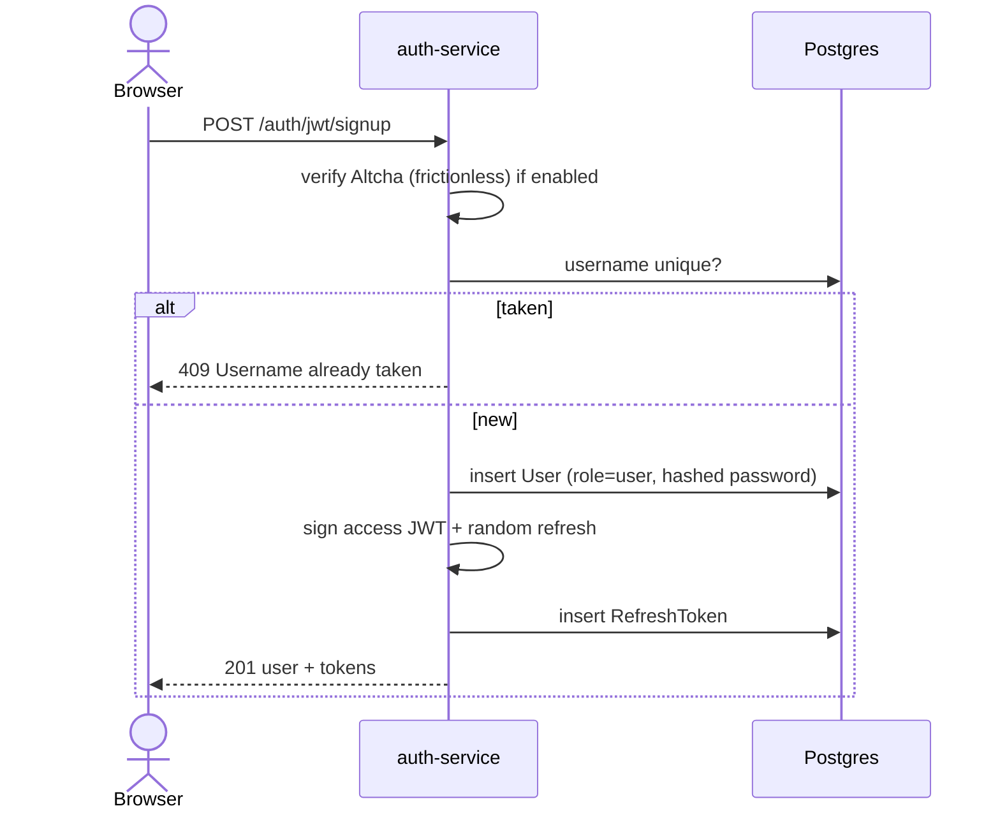

## 3. Google OAuth (issue pair)

Callback mints the same pair, then redirects the public site with tokens in the URL hash (not a cookie).

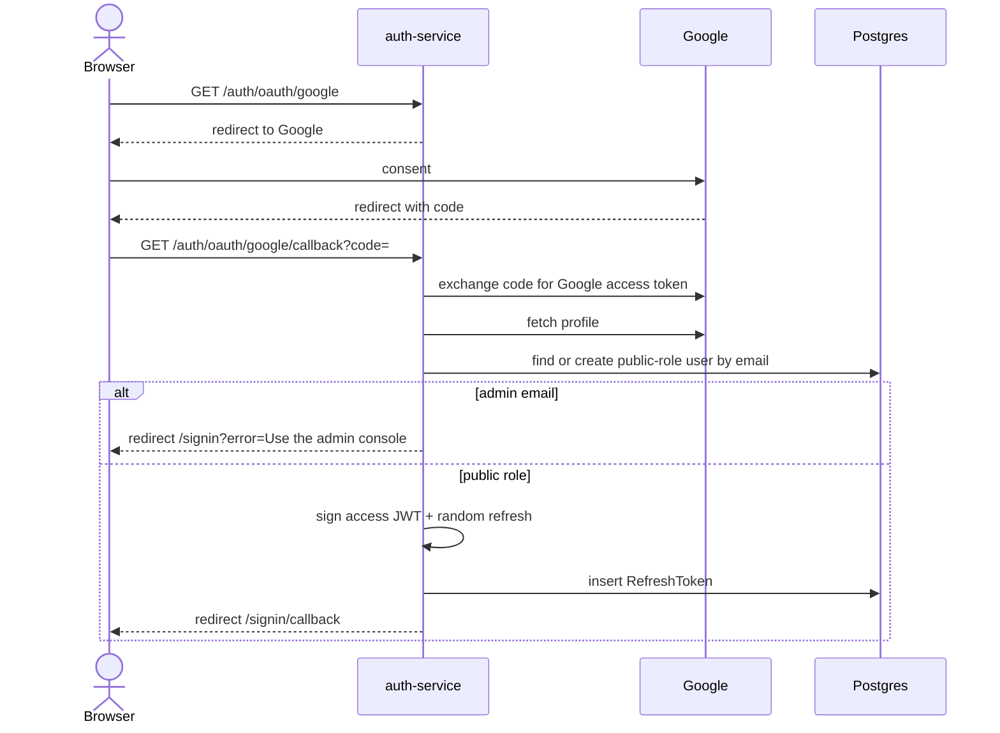

## 4. Admin session then JWT

Admin console uses cookie `rwa.admin.sid`. APIs still need an access JWT, minted from that session. Cookie flags, bootstrap, remint-on-refresh-failure, CORS, and logout: [session.md](session.md).

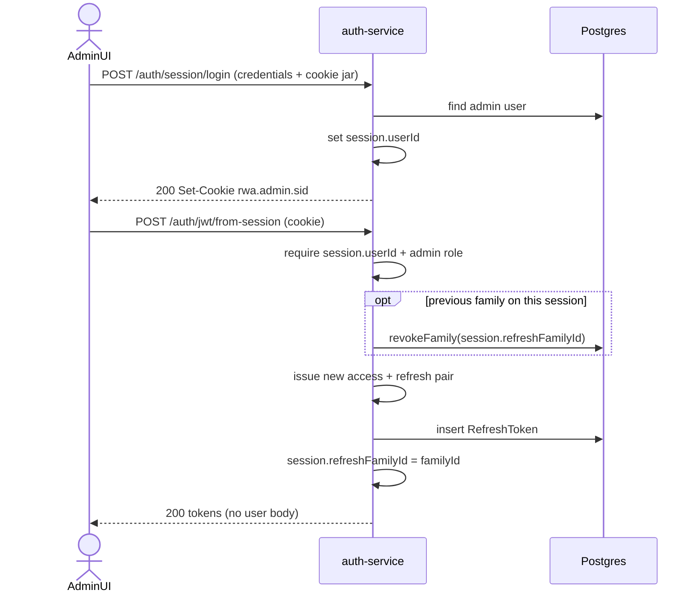

## 5. Required access JWT (REST)

Kong (if `make up services=gateway`) checks first. Backends always check again with `requireJwt`, then load role from the database.

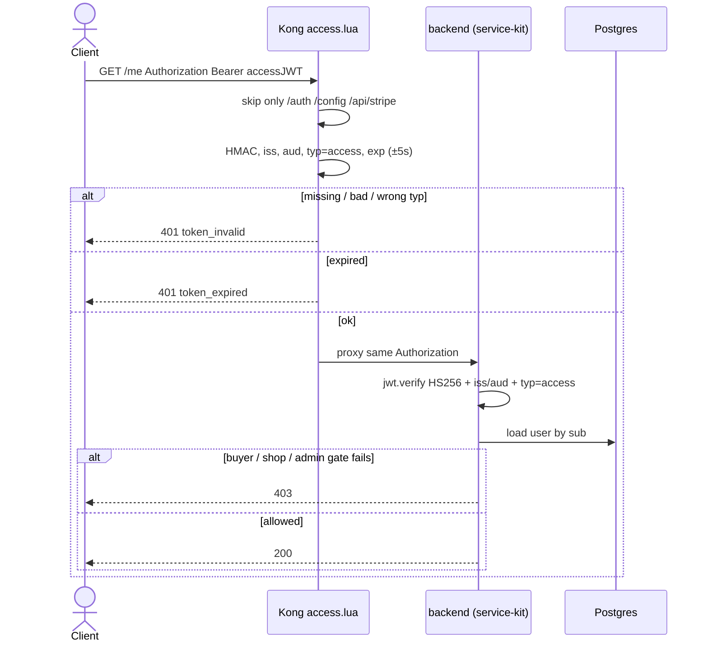

Without Kong, the client hits the service port and only the `requireJwt` half runs.

## 6. Optional JWT (GraphQL frontpage and guest cart)

Anonymous is allowed. If a Bearer is sent, it must still be a valid **access** JWT.

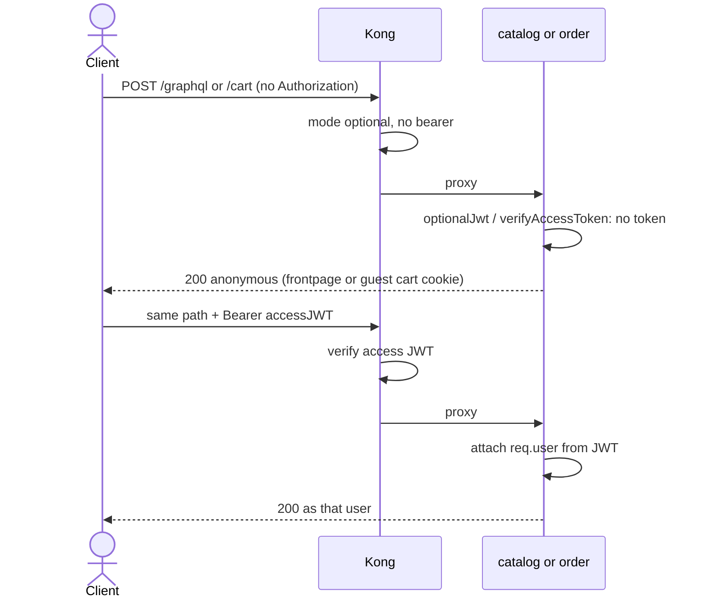

Partner `X-Api-Key` (or `Bearer rwa_live_…`) is GraphQL-only. Kong rejects keys on required REST routes (`API keys can only search books`).

## 7. Refresh rotation (success)

Old refresh row is revoked in a transaction; a new raw token is issued in the **same family**. A new access JWT is signed. Sliding `expiresAt` cannot pass the original `absoluteExpiresAt`.

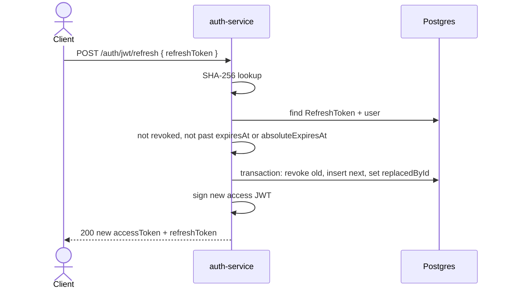

Public and admin UIs call this ~30s before access `expiresAt`, and again if GraphQL returns `UNAUTHENTICATED`.

## 8. Refresh reuse (stolen or replayed token)

Presenting a token whose row already has `revokedAt` (already rotated) kills the **entire family**.

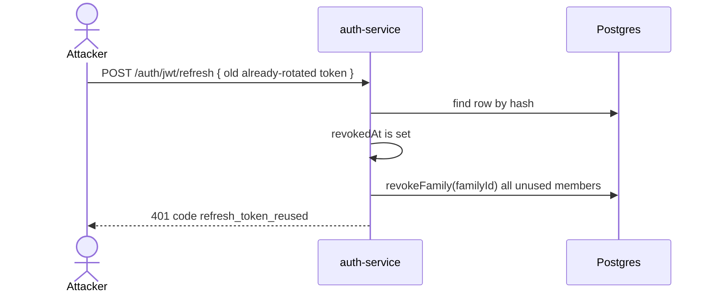

## 9. Refresh expired or unknown

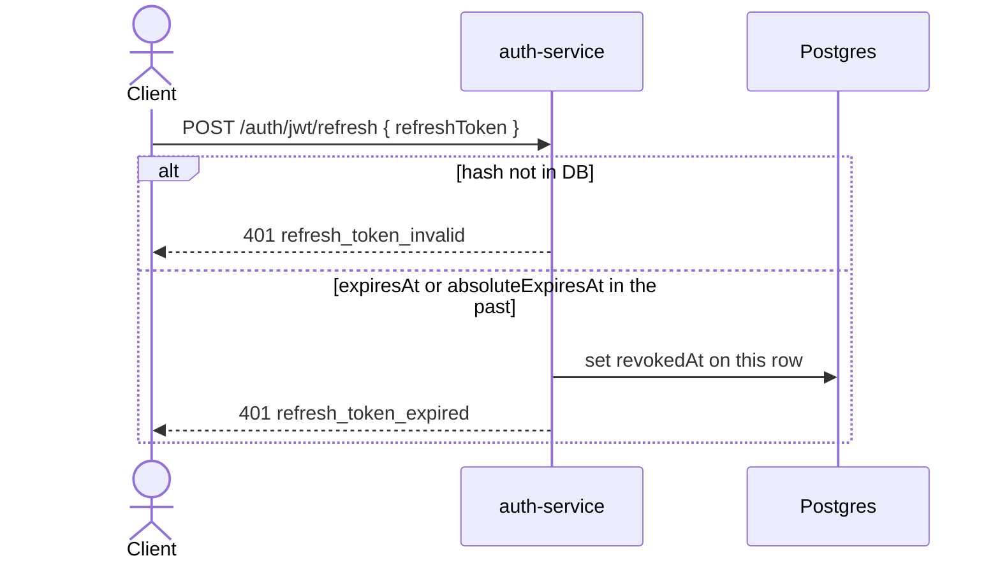

## 10. Logout (revoke refresh family)

Access JWTs already issued keep working until `exp`.

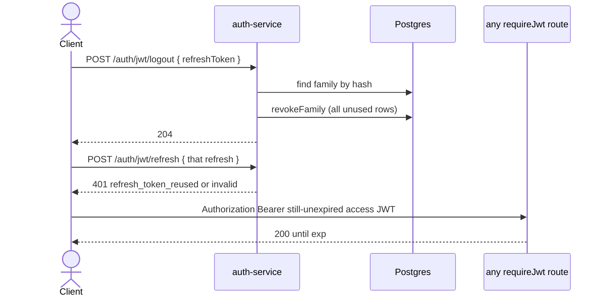

Admin `POST /auth/session/logout` also revokes `session.refreshFamilyId` if present, then destroys the cookie.

## 11. Password reset (revoke all of the user’s refresh rows)

Does not wait for family reuse: every unused refresh for that user is revoked. Access JWTs still live until expiry.

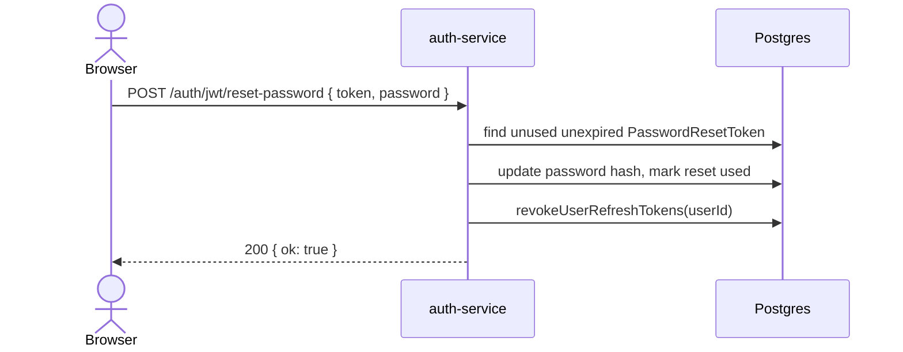

## 12. Refresh used as a Bearer JWT

`typ` must be `access`. The opaque refresh string is not a signed JWT.

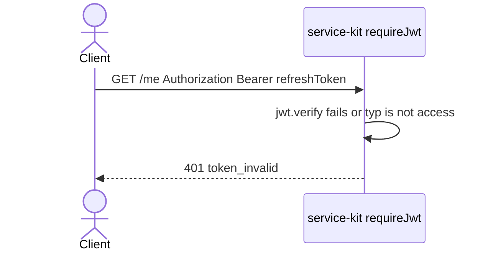

Kong does the same check when the gateway is on (`claims.typ ~= "access"`).
