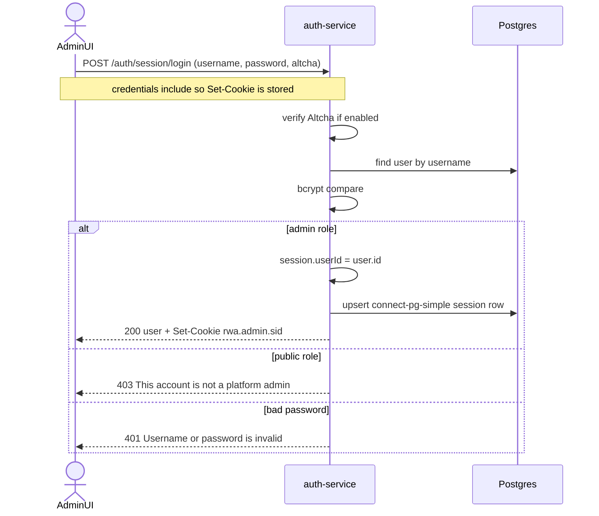
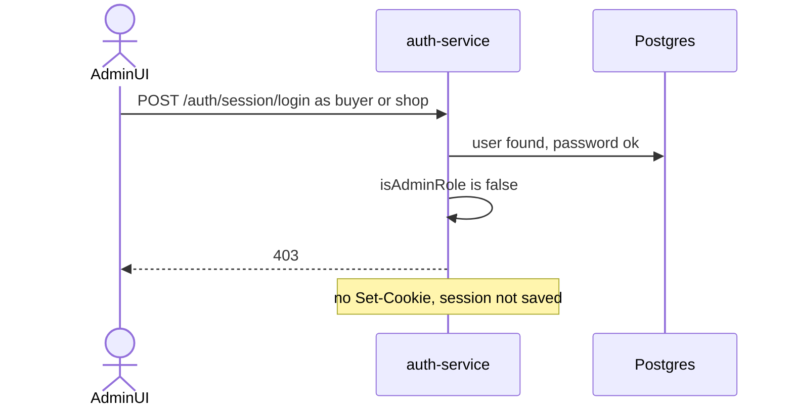
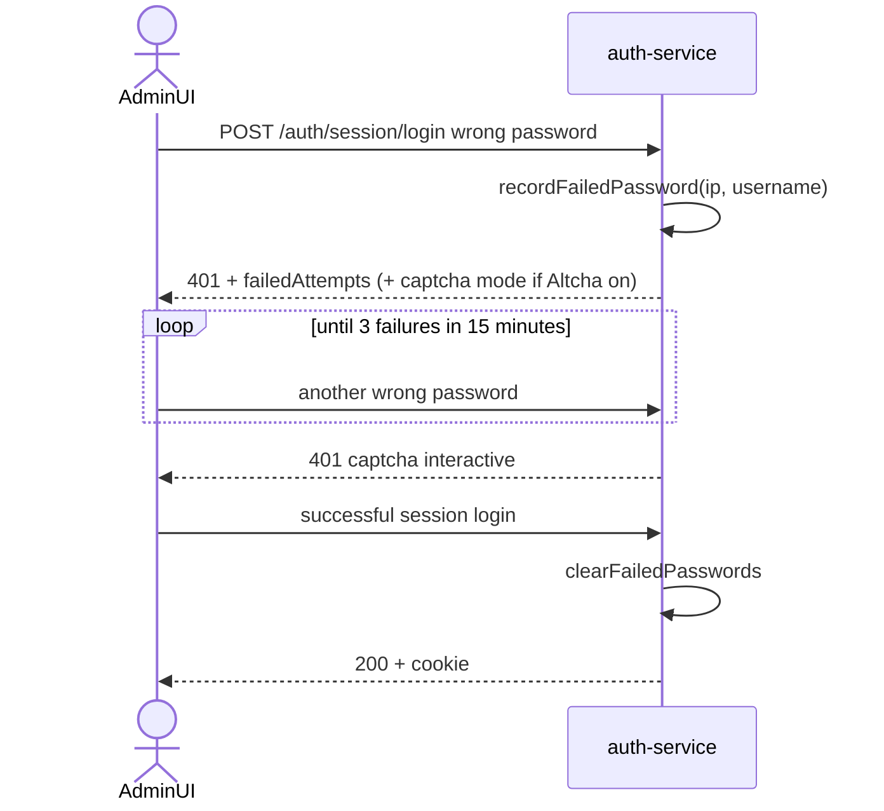
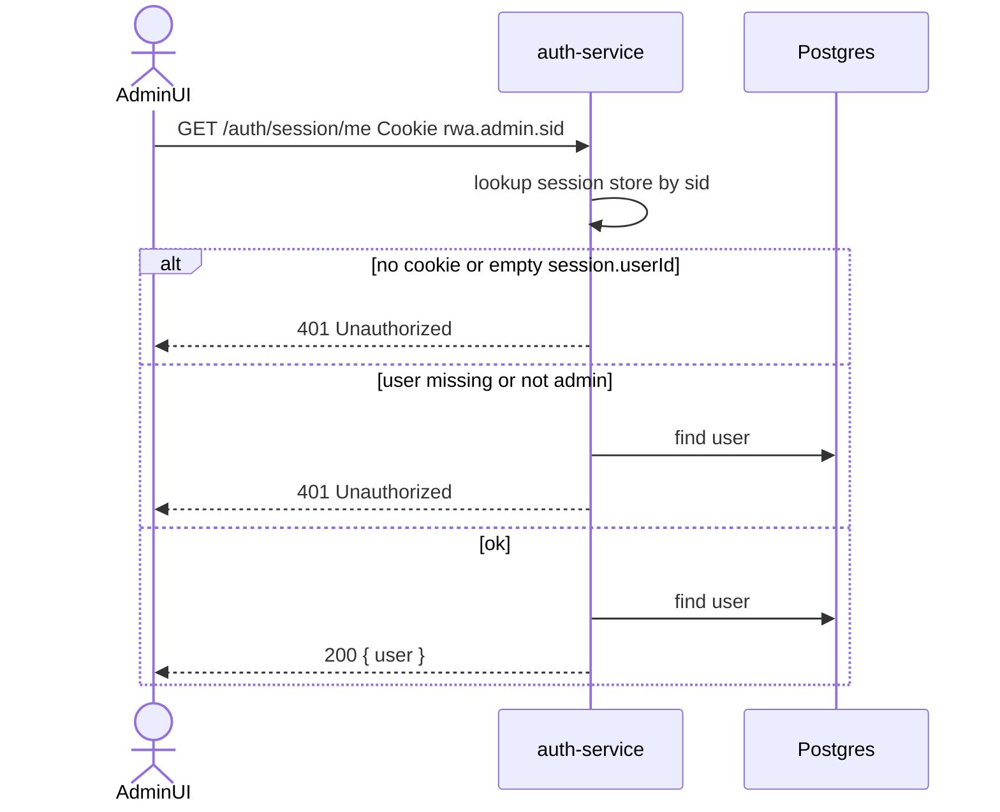
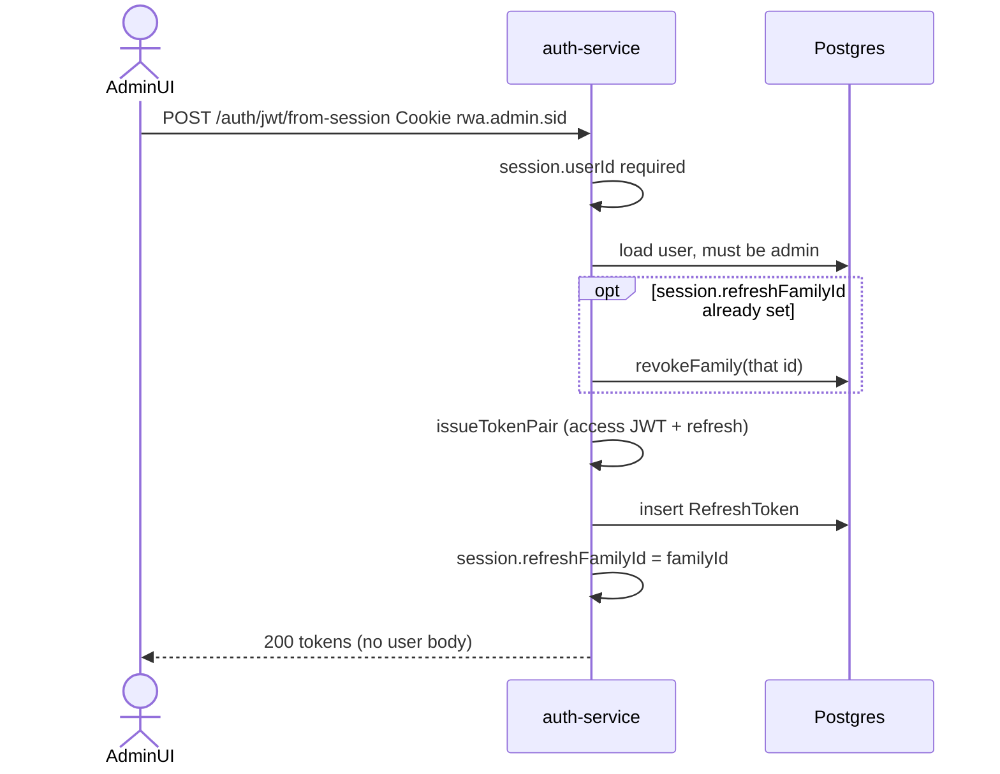
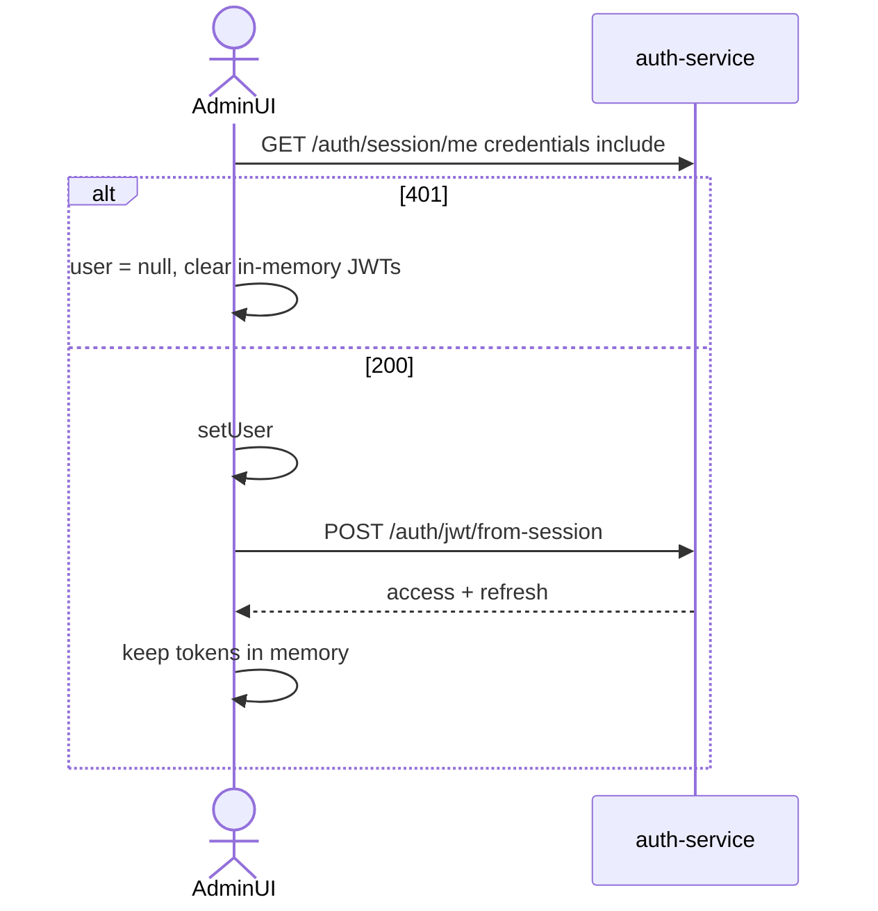
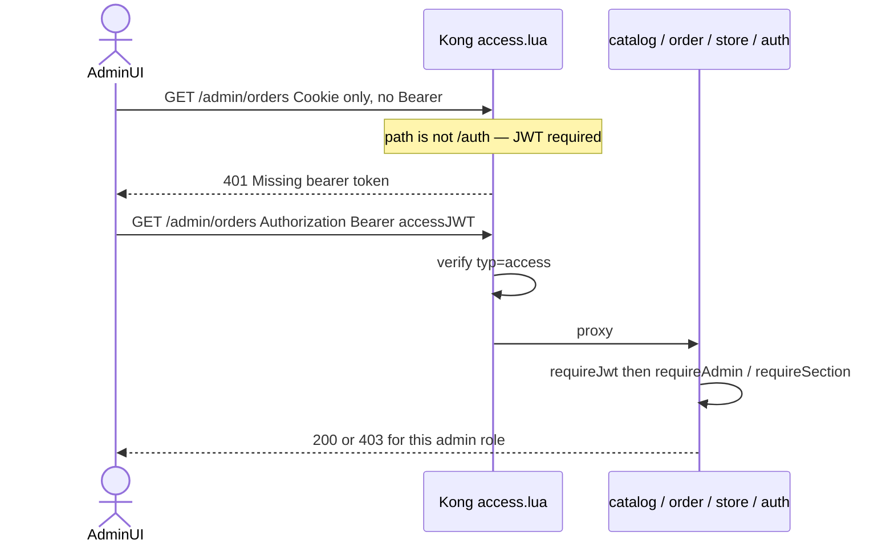
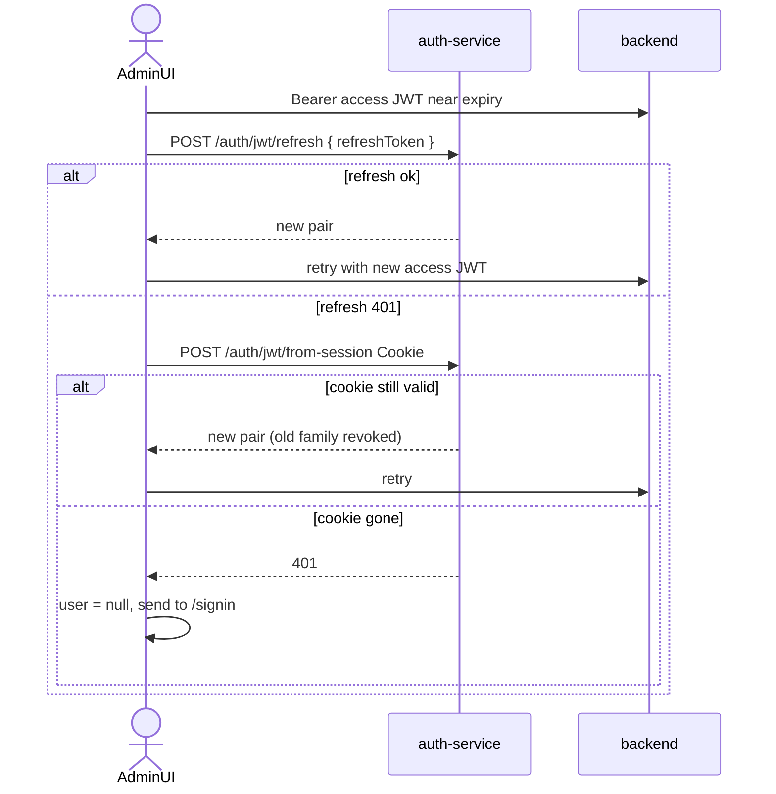
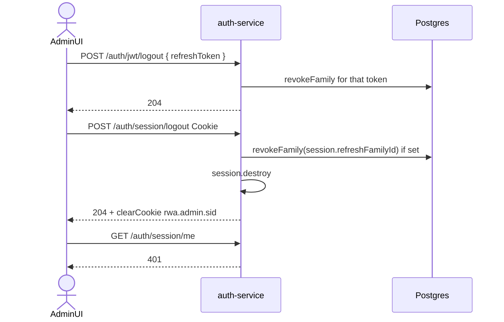
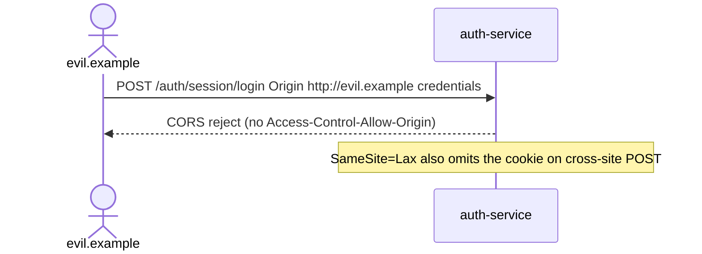

# Admin session authentication

The **public site does not use sessions**. Buyers and shops use JWTs ([jwt.md](jwt.md)). The **admin console** uses an HttpOnly cookie session on auth-service, then mints a JWT from that session for every other API.

Session middleware lives in `backend/auth-service/src/index.ts`. Routes live in `backend/auth-service/src/routes.ts` under `/auth/session/*` and `POST /auth/jwt/from-session`. The admin UI is `frontend/admin/src/auth.tsx` (`credentials: "include"`).

| | Session | Access JWT (after mint) |
| --- | --- | --- |
| Who | Admin console only (`superadmin`, `sales`, `marketing`) | All APIs except `/auth`, `/config`, Stripe webhooks |
| Credential | Cookie `rwa.admin.sid` | `Authorization: Bearer …` |
| Store | Postgres `session` table (`connect-pg-simple`) | Nowhere until `exp` |
| Lifetime | 7 days (`cookie.maxAge`) | 15 minutes (then refresh or remint from cookie) |
| Revoked | `session.destroy` + `clearCookie` | Access JWT still valid until `exp`; refresh family is revoked on logout / remint |

Cookie flags:

| Flag | Value |
| --- | --- |
| Name | `rwa.admin.sid` |
| HttpOnly | yes |
| SameSite | `Lax` |
| Secure | `auto` — only when the request is HTTPS (`trust proxy` + `X-Forwarded-Proto`) |
| Max-Age | 7 days |
| Signed with | `SESSION_SECRET` (express-session) |
| `saveUninitialized` | false (no empty cookie on anonymous hits) |
| `resave` | false |

Session payload in Postgres:

| Field | Set when |
| --- | --- |
| `userId` | `POST /auth/session/login` |
| `refreshFamilyId` | `POST /auth/jwt/from-session` (so logout can revoke that JWT family) |

`GET /admin/*` and GraphQL still require the access JWT. The cookie is **not** accepted as `requireJwt`. Kong skips `/auth` (login, session, captcha) and still requires a JWT on `/admin`, `/me`, `/graphql` mutations, and so on.

Guest cart cookie `rwa.cart` is unrelated (order-service, public site).

---

## 1. Session login (admin)

Same password + Altcha path as public JWT login, then a role gate: only admin roles get a cookie.



The login response does **not** include JWTs. The UI calls `from-session` next (flow 5).

## 2. Public role cannot open an admin session

Buyers and shops must use `POST /auth/jwt/login`. A valid password on the session endpoint is still 403.



The inverse is also true: admins on `POST /auth/jwt/login` get 403 (`Use the admin console to sign in`).

## 3. Failed password and captcha throttle

Shared with public JWT login: username+IP, 15 minute window, 3 failures → interactive Altcha when the flag is on.



## 4. Who am I (`GET /auth/session/me`)

Used on admin bootstrap. Does not mint JWTs. User must still be an admin in Postgres.



## 5. Mint JWT from session

Admin APIs are JWT-gated. After login (or on every page load), the UI posts the cookie and receives an access/refresh pair. A previous family on this session is revoked first so reminting does not leave two live refresh families.



Refresh tokens stay in **memory** in the admin app (not `sessionStorage`). The cookie is what survives a reload.

## 6. Admin UI bootstrap

Reload keeps the cookie. The UI rehydrates the user from `session/me`, then remints JWTs.



## 7. Admin API call (cookie is not enough)

`/admin/users`, GraphQL admin mutations, `/admin/orders`, and so on use `requireJwt`. Kong (when on) also requires a Bearer access JWT. Sending only `rwa.admin.sid` to those paths fails.



`/auth/session/*` and `/auth/jwt/from-session` skip Kong JWT checks because they are under `/auth`.

## 8. Access JWT expired: refresh, then remint from cookie

Admin refresh tries the in-memory refresh token first. If that fails (logout elsewhere, reuse, expiry), it posts `from-session` again while the cookie is still valid.



## 9. Logout

The UI revokes the refresh family, then destroys the session cookie. Outstanding access JWTs still work until `exp`.



## 10. CORS and CSRF

Session login is credentialed. CORS allowlist is `WEB_ORIGIN` and `ADMIN_ORIGIN` plus their http/https twins. `SameSite=Lax` blocks cross-site POSTs from another origin.



## 11. HTTP vs HTTPS cookie Secure flag

`app.set("trust proxy", 1)` and `cookie.secure: "auto"`: Vite HTTP on :3004 gets a non-Secure cookie; nginx HTTPS on :3004 gets `Secure`.

```mermaid
sequenceDiagram
  actor AdminUI
  participant Nginx as nginx TLS
  participant Auth as auth-service

  AdminUI->>Nginx: https://localhost:3004 POST /auth/session/login
  Nginx->>Auth: X-Forwarded-Proto https
  Auth-->>AdminUI: Set-Cookie rwa.admin.sid; Secure; HttpOnly; SameSite=Lax

  Note over AdminUI,Auth: Vite http://localhost:3004 — cookie without Secure
```
